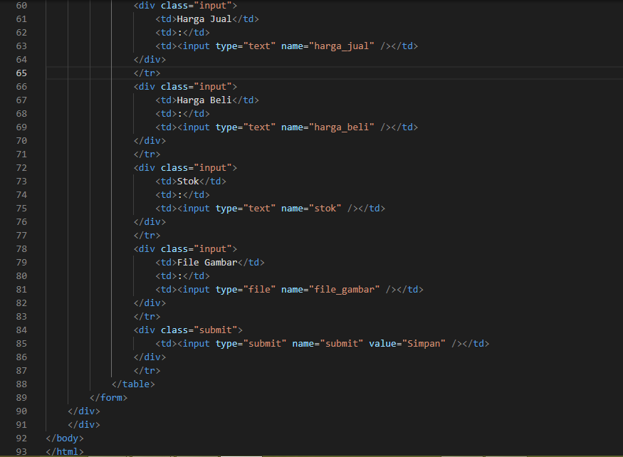

# Lab8Web
Latihan_8 24-5-2022

## Membuat Database
Create database dengan nama `latihan1` , kemudian membuat tabel dan menambahkan data

Membuat Tabel

Menambahkan data pada database

Hasil databasenya

## Membuat koneksi ke database
Buat file dengan nama `koneksi.php` kemudian masukan kodingan berikut

Buka melalui browser untuk menguji koneksi database, jika berhasil maka tampilan seperti ini

## Menampilkan data (Read)
Membuat file `index.php` untuk menampilkan data atau read database, kodinganya seperti ini

Buka melalui browser, maka tampilan akan seperti ini

## Menambahkan data (Creat)
Membuat file dengan nama `tambah.php` untuk menambahkan data dan akan masuk ke database

Kemudian klik `tambah barang` pada halaman utama, maka akan menuju halaman `tambah.php`

Tampilan saat sudah tambah barang

## Mengubah data (Update)
Membuat file dengan nama `ubah.php` untuk mengubah data barang

Kemudian klik `ubah` pada halaman utama, maka akan menuju halaman `ubah.php`

Tampilan saat sudah ubah barang

## Menghapus Barang (Delete)
Membuat file dengan nama `hapus.php` untuk menghapus data barang

Kemudian klik `hapus` pada halaman utama maka data akan terhapus

